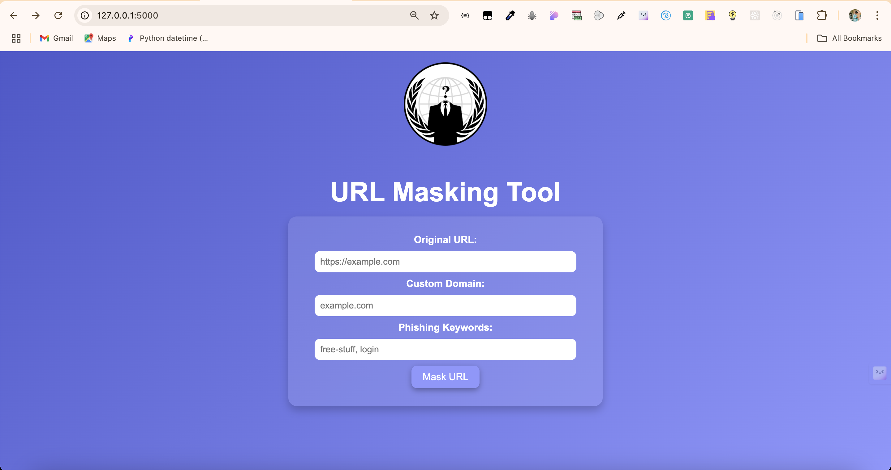

# URL Masker

A simple Flask-based web application that allows users to mask URLs by combining custom domains and phishing keywords. This tool is designed for educational purposes and should be used responsibly.

## Features

- Input original URLs, custom domains, and phishing keywords.
- Generates multiple masked URLs using popular URL shorteners.
- Fully responsive and mobile-friendly design.
- Validation ensures all fields are filled correctly before displaying results.

## Installation

1. **Clone the Repository**:

   ```bash
   git clone https://github.com/anandvelpuri/url-masker.git
   cd url-masker
   ```

2. **Create and Activate a Virtual Environment**:
   ```bash
   python3 -m venv venv
   source venv/bin/activate  # On Windows: venv\Scripts\activate
   ```
3. **Install Dependencies**:
   ```bash
   pip install -r requirements.txt
   ```
4. **Run the Application**:
   ```bash
   python app.py
   ```
5. Open your browser and go to: [http://127.0.0.1:5000](http://127.0.0.1:5000)

## File Structure

```
project-root/
├── app.py                # Main Flask application
├── requirements.txt      # Python dependencies
├── static/
│   ├── css/
│   │   └── styles.css    # Custom styles
│   ├── images/
│   │   └── logo.png      # Application logo
├── templates/
│   └── index.html        # HTML template
└── README.md             # Project documentation
```

## Usage

1. Enter the **original URL** (e.g., `https://example.com`).
2. Provide a **custom domain** (e.g., `example.org`).
3. Enter **phishing keywords** (e.g., `free-stuff` or `login`).
4. Click the "Mask URL" button.
5. If all fields are valid, masked URLs will be displayed below the form.

## Dependencies

- Flask
- pyshorteners

Install dependencies using:

```bash
pip install -r requirements.txt
```

## Screenshots



## License

This project is licensed under the **MIT License**. See the [LICENSE](LICENSE) file for details.

## Disclaimer

This tool is for educational purposes only. Misuse of this tool for malicious purposes is strictly prohibited. The creator is not responsible for any unethical use of this application.

## Contributing

Contributions are welcome! Feel free to submit a pull request or report issues.

## Developed By

**Anand Velpuri**  
[GitHub](https://github.com/anandvelpuri)  
[Email](mailto:velpurianand8005@gmail.com)

```

Let me know if you need further customization or clarification!
```
